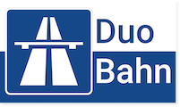

# kotlin-surfaceduo-duobahn
> DuoBahn for Surface Duo will be an Kotlin Compose-based Android app for foldable devices that uses the federal German Autobahn API as a data source.

## Build status

|Service|Status|
|-------|------|
|GitHub| - |

## Idea

### Fasicilitating an open, federal API
The [open data / open api project of the German government](https://autobahn.api.bund.dev) contains a lot of information of Auotbahnen (highways) is one of the things I think should be promoted as "hey guys, we have a lot of free (tax-paid) data sets - let's use them our way!".

### Why the focus on Surface Duo?
I'm not an Android user, I do not really like this operating system but it has some quite interesting devices in its ecosystem. One of them is the Microsoft Surface Duo. A dual screen device which could be the first mainstream foldable device for developers. 

The [Microsoft DX team](https://techcommunity.microsoft.com/t5/surface-duo-sdk/bd-p/SurfaceDuoSDK) around all the diffrent SDKs for the Duo's unique features is very responsive and helpful - and of course beginner friendly. Their weekly stream on Twitch is sometimes really motivating to spend my rare spare time into learning and building something new. That's why I choose this specific target device. In my day job I write a lot of B2B enterprise iOS / iPadOS applications - all of the devices just have one screen since decades. Let's by experimental and play with something new - two screens to be precises.

### Learning Kotlin Compose
One of the reasons why I started this project is to get into at first into Kotlin and in second into the new UI describing concept of Compose. My former beloved Xamarin.Forms tech stack could be a fallback, but the main goal ist to write it in Kotlin compose and maybe have a Compose Multiplatform app to run on Android, desktop systems and on the web.

### Why a fetching script is required?
The offical API ([Swagger](https://autobahn.api.bund.dev), [openapi.yaml](https://autobahn.api.bund.dev/openapi.yaml)) does not support a "fetch 'em all" approach. To fetch all available and required information for the app, a lot of `id` based requests have to be made. These approach is not fisable for a mobile app to be as user interaction responsible as possible. Besids this fact, in a world in which this app gets thousands of users I would guess some rate limit or resource caps would be applied by the API.

You can find the concept of the aggreagor script at [script_concept.md](https://github.com/tscholze/kotlin-surfaceduo-duobahn/blob/main/resources/script_concept.md).

## Prerequisites

### Script
* An environment that supports peridocally script executions
* Public web store to save the generated, monolyhic JSON file

### App
* Android Studio (Artic Fox or higher)
* Surface Duo emulator, Android emulator or actual an device

## Structure
* `resources/` contains for example used api definitions
* `scripts/` contains all required scripts to aggregate data
* * `docs/` contains all documention and readme based file
* `app/` contains all Android app related files

# Publications
- Dr. Windows [Auf zu unseren neuen Surface Duo App „DuoBahn“: Teil 1](https://www.drwindows.de/news/auf-zu-unseren-neuen-surface-duo-app-duobahn-teil-1) article

## Please keep in mind
This project has absolutely neither time line until it is production ready nor that it's the perfect example writing scripts, Kotlin apps or using the feature of a Surface Duo device. It's a playground for me to learn new skills and play around with new concepts like dual screen devices.

## Other programms I used
- Microsoft [OneNote](https://www.onenote.com/) as information storage around the idea of the app
- Microsoft [Teams](https://products.office.com/en-US/microsoft-teams/group-chat-software) to clarify open question with the Dr. Windows team
- [Visual Studio Code](https://code.visualstudio.com/) for all, except source code editing, writings like mark down files
- [Figma](https://figma.com) for any graphical asset

## Authors

At the moment, it is just me, [Tobi]([https://tscholze.github.io).

## Acknowledgments

* [Dr. Windows](https://drwindows.de) community
* [Federal Autobahn API](https://autobahn.api.bund.dev/)
* [Surface Duo SDK Technet Community](https://techcommunity.microsoft.com/t5/surface-duo-sdk/bd-p/SurfaceDuoSDK) for helping beginners, too.

## License

This project is licensed under the MIT License - see the [LICENSE](LICENSE) file for details.
Dependencies or assets maybe licensed differently.
